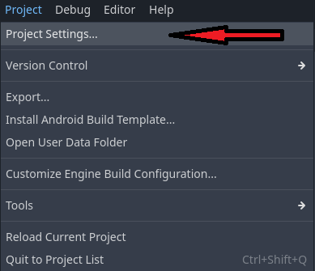

# simpleunittests
Implements simple unit tests for Godot.net. The project is kept very simple to encourage users to modify it to meet their needs.

# Usage
Download and put the entire directory inside your projects addons-folder and than activate it under Project settings -> Plugins.




To implement your own tests derrive from TestSuite and mark each method that is a test with the TestCase-Attribute. 

```
using SimpleUnitTests;

namespace Tests
{
    public class TestTemplate : TestSuite
    {
        public TestTemplate() : base("Test template")
        {
        }

        [TestCase]
        public void TestInteger()
        {
            AssertEqual(1, 1);
            AssertNotEqual(1, 2);
        }

        private void TestHelper(object o)
        {
            if(o == null)
            {
                throw new ArgumentNullException(nameof(o));
            }
        }

        [TestCase()]
        public void ExceptionTest()
        {
            AssertException<ArgumentNullException>(() =>
            {
                TestHelper(null);
            });
        }
    }
}
```


