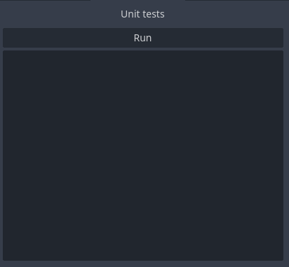

# simpleunittests
Implements unit tests for Godot.net. The project is kept very simple and small to encourage users to modify it to meet their needs.

# Installation
Download and put the entire directory inside your projects addons-folder and than activate it under Project settings -> Plugins.


After that the testrunner window should show up. It looks like this:



# Usage
To implement your own tests derrive from TestSuite and mark each method that is a test with the TestCase-Attribute. 
The TestSuite implements some methods that you can use to write your tests (AssertEqual, AssertNotEqual and AssertException). 
Here is an example of how to write tests: 

```
using SimpleUnitTests;

namespace Tests
{
    public class TestTemplate : TestSuite
    {
        public TestTemplate() : base("Test template")
        {
        }

        [TestCase]
        public void TestInteger()
        {
            AssertEqual(1, 1);
            AssertNotEqual(1, 2);
        }

        // A disabled test case
        [TestCase(false)]
        public void DeactivatedTest()
        {
            AssertEqual(true, true);
            AssertNotEqual(true, false);
        }

        private void TestHelper(object o)
        {
            if(o == null)
            {
                throw new ArgumentNullException(nameof(o));
            }
        }

        [TestCase()]
        public void ExceptionTest()
        {
            AssertException<ArgumentNullException>(() =>
            {
                TestHelper(null);
            });
        }
    }
}
```

Once your tests are written, click build in the upper right of the Godot Editor and than Run inside the test runner window. 

The test runner will look for all TestSuites in the currently running assembly and run all tests cases it can find. The results will be shown
inside the test runner window. If a test fails you might not be able to read the entire error message. But you can hover with your mouse over
the error message and Godot will show the message as a tooltip. 

The project contains a file named TestTemplate.cs. This serves as an example on how to write test cases and is itself
a TestSuite to test the unit tests itself. These tests will also be found by the test runner when it looks for tests suites. This is on purpose
to aid the development of this plugin. However if you don´t want these tests to run you can either delete the template file or deactivate 
the test cases by giving a false to the attribute constructor. 

